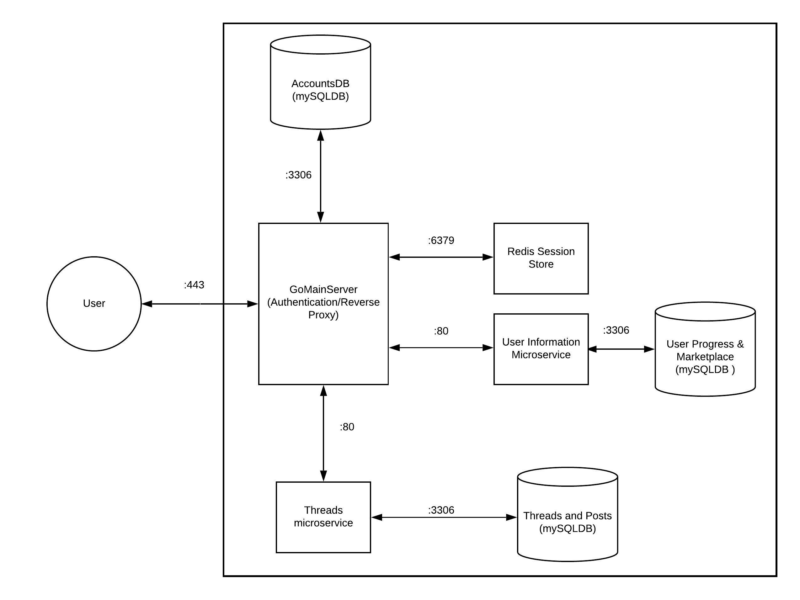

# Project Proposal: Addiction Support Forums
By Ashmann Syngle, Shray Arora and Sarah West

## Project Pitch
For our project, our target audience is people struggling with addictive substances, such as nicotine. 
Quitting nicotine is hard, especially when you lack support. Groups like Alcoholics Anonymous exist for people with alcoholism, but there aren’t very many groups for people addicted to nicotine products, such as vaping or smoking. There are also people who don’t know where to start with the whole process of quitting.
Our platform will allow users struggling with nicotine addiction to connect with one another to exchange advice and offer support. 
It will be forum-based, with various threads that people can search for and respond to. Users can also create new threads about a variety of subjects regarding addiction. Along with the forums, our site will help keep track of a user's progress towards sobriety, awarding them points which can be exchanged for achievement badges to be included on one's profile.
This site can serve as an alternative to reddit or facebook as it reduces the need to create “throwaway accounts” to have anonymity when discussing sensitive subjects. Furthermore, the progress and incentive features allows our site to be more engaged and focused on our user's goals and motivation, unlike the aforementioned cites.

## Technical Description
### Endpoints
#### Users
* /v1/users
    * **POST**: Create a new user
        * 201: User successfully created
        * 415: Unsupported Media Type
* /v1/users/**{userID}** _or_ **‘me’**
    * **GET**: Get a user
        * 200: User successfully retrieved
        * 401: Status Unauthorized
        * 404: User Not Found
    * **PATCH**: Update a user
        * 200: User successfully updated
        * 403: Status Forbidden
        * 415: Unsupported Media Type
#### The Marketplace
* v1/marketplace/**{ItemID}**
    * **PATCH**: Updates current user with recently bought item
        * 200: Item successfully added to user’s profile
        * 403: Status Forbidden 
        * 415: Unsupported Media Type
    * **DELETE**: Delete the item from the users profile
        * 200: Item successfully deleted
        * 403: Status Forbidden

#### The Forum Itself 
* /v1/threads
    * **GET**: Thread homepage
        * 200: Return list of the latest threads or the pinned threads (if any)
        * 500: Internal Server Error
* /v1/threads/tagged/[tagname]
    * **GET**: Threads under the tag [tagname]
        * 200: Return list of most recent/pinned threads containing that tag
        * 500: Internal Server Error
* /v1/threads/id/{threadID}
    * **GET**: Thread with inputted thread ID
        * 200: Returns list of posts in chronological order that were made in that specific thread
        * 404: Thread not found
        * 500: Internal Server Error
    * **POST**: Reloads page and adds newly submitted post to the end of the thread
        * 200: Returns list of posts in chronological order that were made in that specific thread, goes immediately to new post
        * 401: Status Unauthorized
        * 404: Thread not found
        * 500: Internal Server Error
    * **DELETE**: Deletes thread and redirects user back to /v1/others
        * 200: Thread is deleted--triggers redirect and reloads /v1/others with original thread now deleted
        * 401: Unauthorized--user cannot delete thread unless they are the one who created it
        * 404: Thread not found
        * 500: Internal Server Error
* /v1/posts/{postID}
    * **PATCH**: User edits post in a thread
        * 200: Post successfully updated
        * 403: Status Forbidden 
        * 415: Unsupported Media Type
        * 500: Internal Server Error
* /v1/sessions
    * **POST**: Begin a new session using an existing user's credentials.
        * 201: New session successfully created
        * 401: Status Unauthorized
        * 415: Unsupported Media Type
* /v1/sessions/mine
    * **DELETE**: Ends the current user’s session
        * 200: Session successfully ended
        * 403: Status Forbidden

### User Cases and Priority

|  Priority | User  | Description  | Technical Implementation  |
|---|---|---|---|
| P0  | Registered User  | I want to be able to create my own threads  | User will send a **POST request** to the /v1/threads/ endpoint. This will insert a new row into the **threads table of the threads/posts database**, where a new threadID will be created. This threadID can be used in a **GET request** to find the created thread later.  |
| P0  | Registered User  | I want to be able to respond to other threads  | User will send a **POST request** to the /v1/threads/id/{threadID} endpoint. This will then insert a row into the **threads table of the threads/posts database** which will symbolizes a new post to the thread that has that threadID.  |
| P0  | Registered/Unregistered User  | I want to be able to view various threads, both either by most recent or organized by tag names  | User will send a **GET request** to /v1/threads/ to find a list of threads, which will be organized by newest creation date by default. To search for a specific tag, the user would send a **GET request** to /v1/threads/tagged/[tagname], with their desired tag name as part of the http.Request. |
| P1  | Registered/Unregistered User  | I want to find pinned posts that may describe thread rules or resources  | Like above, the user will send a **GET request** to /v1/threads/ to find a list of threads. Pinned posts will always be placed at the top of the list.  |
| P1  | Registered User  | I want to keep track of my progress on my goal towards sobriety  | The server will display information regarding the user’s progress by accessing the **progress column** of the **users table in the users/marketplace/process database** (i.e. running a query). It will then display said progress at the top of the page when the user signs in for the first time that day.  |
| P1  | Registered User  | I want to exchange the points I receive by logging in for badges to add to my profile  | User would send a **PATCH request** to v1/marketplace/{ItemID}, where the ItemID will be an input included with their request. The ItemID corresponds to a table of possible items and badges from **the users/marketplace/process database**. From there, the user’s profile will update to include the page they selected.  |
| P2  | Unregistered User  | I want to know how to sign up  | User would locate the sign-up page in the web client. Then, they would send a **POST request** with their inputted information (email, password, etc.) to create their account, similar to UserHandler.  |

---

