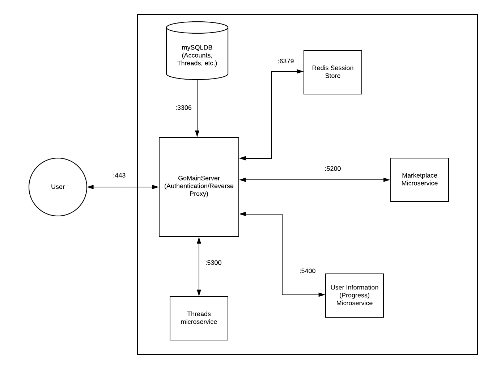

# Project Proposal: Eradicate The Vape
By Ashmann Syngle, Shray Arora and Sarah West

## Project Pitch
For our project, our target audience is people struggling with addictive substances, such as nicotine. 
Quitting nicotine is hard, especially when you lack support. Groups like Alcoholics Anonymous exist for people with alcoholism, but there aren’t very many groups for people addicted to nicotine products, such as vaping or smoking. There are also people who don’t know where to start with the whole process of quitting. Most addicts are unaware that there exist certain patterns or trends in their addiction behaviour. Our project aims to help nicotine addicts notice these patterns through the use of a 'sobriety clock' in order to prevent possible relapses. 

The 'sobriety clock' requires the user to clock-in everyday they don't use nicotine. For every day that they clock-in, the users are awarded some points which can be thought of as a 'currency' to our website's marketplace. The marketplace will include badges that the user can pin to their profile in a similar way to how people in Alcoholics Anonymous recieve badges for  milestones achieved in the quitting process.

Additionally, our platform will allow users struggling with nicotine addiction to connect with one another to exchange advice and offer support. It will be forum-based, with various threads that people can search for and respond to. Users can also create new threads about a variety of subjects regarding addiction. 

This site can serve as an alternative to reddit or facebook as it reduces the need to create “throwaway accounts” to have anonymity when discussing sensitive subjects. Furthermore, the progress and incentive features allows our site to be more engaged and focused on our user's goals and motivation, unlike the aforementioned cites.

## Technical Description
### Endpoints
#### Users
* /v1/users
    * **POST**: Create a new user
        * 201: User successfully created
        * 400: Status Bad Request (invalid user information sent by client)
        * 405: Status Method Not Allowed
        * 415: Unsupported Media Type
* /v1/users/**{userID}** _or_ **‘me’**
    * **GET**: Get a user
        * 200: User successfully retrieved
        * 401: Status Unauthorized
        * 404: User Not Found
        * 405: Status Method Not Allowed
    * **PATCH**: Update a user
        * 200: User successfully updated
        * 403: Status Forbidden
        * 405: Status Method Not Allowed
        * 415: Unsupported Media Type
#### The Marketplace
* v1/marketplace
    * **GET**: Gets all badges in the Marketplace
        * 200: Badges successfully retrieved
        * 401: Status Unauthorized
        * 405: Status Method Not Allowed
        * 500: Internal Server Error
* v1/marketplace/**{BadgeID}**
    * **GET**: Gets all badges for specific user
        * 200: Badges successfully retrieved
        * 400: Status Bad Request (invalid user id sent by client)
        * 401: Status Unauthorized
        * 405: Status Method Not Allowed
        * 500: Internal Server Error (if there is some error in the SQL scan)
    * **PATCH**: Updates current user with recently bought badge
        * 200: Item successfully added to user’s profile
        * 400: Status Bad Request (invalid badge id sent by client)
        * 401: Status Unauthorized
        * 405: Status Method Not Allowed
        * 500: Internal Server Error (if there is some error in the SQL scan)
    * **DELETE**: Delete the item from the users profile
        * 200: Item successfully deleted
        * 401: Status Unauthorized
        * 403: Status Forbidden
        * 405: Status Method Not Allowed
        * 500: Internal Server Error (if there is some error in the SQL scan)

#### The Threads Itself 
* /v1/threads
    * **GET**: Get most recent threads 
        * 200: Return list of the latest threads (if any)
        * 400: Status Bad Request (invalid badge id sent by client)
        * 401: Status Unauthorized
        * 500: Internal Server Error (if there is any error in SQL or encoding response)
    * **POST**: Creates a new thread
        * 201: Thread successfully created
        * 400: Status Bad Request (invalid thread creation request by client)
        * 401: Status Unauthorized
        * 500: Internal Server Error (if there is any error in encoding response)
* /v1/threads/**{ThreadID}**
    * **GET**: Thread with inputted thread ID
        * 200: Returns list of posts in chronological order that were made in that specific thread
        * 400: Status Bad Request (invalid user in header)
        * 401: Status Unauthorized
        * 500: Internal Server Error (if there is any error in encoding response)
    * **POST**: Adds newly submitted post to the end of the thread
        * 201: Post successfully created and added to end of thread
        * 400: Status Bad Request (invalid user in header)
        * 401: Status Unauthorized
        * 404: Thread for specific post not found
        * 500: Internal Server Error (if there is any error in encoding response)
    * **DELETE**: Deletes thread 
        * 200: Thread is successfully deleted
        * 400: Status Bad Request (invalid user in header)
        * 401: Status Unauthorized
        * 404: Thread to delete not found
        * 500: Internal Server Error (if there is any error in deleting the thread)
* /v1/posts/**{PostID}**
    * **PATCH**: User edits post in a thread
        * 200: Post successfully updated
        * 400: Status Bad Request (invalid user in header)
        * 403: Status Forbidden 
        * 404: Post to update not found
        * 415: Unsupported Media Type
        * 500: Internal Server Error (if there is any error in the SQL or encoding response)

#### The Session Store (Redis) 
* /v1/sessions
    * **POST**: Begin a new session using an existing user's credentials.
        * 201: New session successfully created
        * 401: Status Unauthorized
        * 405: Status Method Not Allowed
        * 415: Unsupported Media Type
* /v1/sessions/mine
    * **DELETE**: Ends the current user’s session
        * 200: Session successfully ended
        * 403: Status Forbidden
        * 405: Status Method Not Allowed

#### The User Progress 
* /v1/progress
    * **GET**: Get progress of current user (also creates a progress tracker if first time logging in)
        * 200: Successully gets the progress information of current user
        * 400: Status Bad Request (invalid user in header)
        * 500: Internal Server Error (if there is any error in SQL insertion)
    * **PATCH**: Updates current user progress
        * 200: Successully updated the progress of current user
        * 400: Status Bad Request (invalid user in header or invalid request by client)
        * 500: Internal Server Error (if there is any error in SQL updating)
* /v1/progress/
    * **POST**: Updates points of current user (for threads and post creation)
        * 200: Successully updates the points of current user
        * 400: Status Bad Request (invalid user in header)
        * 401: Status Unauthorized
        * 405: Status Method Not Allowed
        * 500: Internal Server Error (if there is any error in SQL insertion)

### User Cases and Priority

|  Priority | User  | Description  | Technical Implementation  |
|---|---|---|---|
| P0  | Registered User  | I want to be able to create my own threads  | User will send a **POST request** to the /v1/threads/ endpoint. This will insert a new row into the **threads table of the threads/posts database**, where a new threadID will be created. This threadID can be used in a **GET request** to find the created thread later.  |
| P0  | Registered User  | I want to be able to respond to other threads  | User will send a **POST request** to the /v1/threads/id/{threadID} endpoint. This will then insert a row into the **threads table of the threads/posts database** which will symbolizes a new post to the thread that has that threadID.  |
| P0  | Registered/Unregistered User  | I want to be able to view various threads, both either by most recent or organized by tag names  | User will send a **GET request** to /v1/threads/ to find a list of threads, which will be organized by newest creation date by default. To search for a specific tag, the user would send a **GET request** to /v1/threads/tagged/[tagname], with their desired tag name as part of the http.Request. |
| P1  | Registered/Unregistered User  | I want to find pinned posts that may describe thread rules or resources  | Like above, the user will send a **GET request** to /v1/threads/ to find a list of threads. Pinned posts will always be placed at the top of the list.  |
| P1  | Registered User  | I want to keep track of my progress on my goal towards sobriety  | The server will display information regarding the user’s progress by accessing the **progress column** of the **users table in the users/marketplace/process database** (i.e. running a query). It will then display said progress at the top of the page when the user signs in for the first time that day.  |
| P1  | Registered User  | I want to exchange the points I receive by logging in for badges to add to my profile  | User would send a **PATCH request** to v1/marketplace/{ItemID}, where the ItemID will be an input included with their request. The ItemID corresponds to a table of possible items and badges from **the users/marketplace/process database**. From there, the user’s profile will update to include the page they selected.  |
| P2  | Unregistered User  | I want to know how to sign up  | User would locate the sign-up page in the web client. Then, they would send a **POST request** with their inputted information (email, password, etc.) to create their account, similar to UserHandler.  |

### Architectural Diagram

When the user makes a request to our website, the gateway server first authenticates the user and verifies the session token provided against the redis store. Based on this request, the reverse proxy will redirect the request to either the ‘Threads’ microservice, the 'Marketplace' microservice or the ‘Progress’ microservice. The Threads microservice will render a page that will show the threads and posts stored in our main database. The 'Marketplace' Microservice will render a page that will show information about the badges from our marketplace. The 'Progress' Microservice will render a page that will show information about the user progress from our database. Finally, database will contain specific user data and information from all our microservices.

### Appendix

#### Database Schemas

* **Users**:
  * **id** int primary key auto_increment not null,
  * **email** varchar(80) not null,
  * **passHash** char(60) not null,
  * **username** varchar(255) not null,
  * **firstName** varchar(64) not null,
  * **lastName** varchar(128) not null,
  * **bio** varchar(500) not null,
  * **points** int not null,
  * **photoUrl** varchar(255) not null
  
* **Progress**:
  * **progressID** int primary key auto_increment not null,
  * **daysSober** int not null,
  * **userID** int not null,
  * foreign key (userID) references Users(id)

* CREATE UNIQUE INDEX email_index ON Users (email);

* CREATE UNIQUE INDEX username_index ON Users (username);

* **Marketplace**:
  * **badgeID** int primary key auto_increment not null,
  * **cost** int not null
  * **badgeName** varchar(30) not null
  * **badgeDescription** varchar(255) not null
  * **imgURL** varchar(255) not null
  
* **Badges**:
  * **badgeID** int not null,
  * **userID** int not null,
  * foreign key (badgeID) references Marketplace(badgeID)
  * foreign key (userID) references Users(id)

* CREATE UNIQUE INDEX badge_index ON Badges (badgeID, userID);

* **Threads**:
  * **threadID** int primary key auto_increment not null
  * **threadName** varchar(80) not null
  * **threadDescription** varchar(500)
  * **userWhoCreatedID** int not null
  * **anon** bool default false not null
  * **timeCreated** datetime not null
  * **editedAt** datetime not null
  * foreign key (userWhoCreatedID) references Users(id)

* CREATE UNIQUE INDEX thread_index ON Threads (threadName);

* **Posts**:
  * **postID** int primary key auto_increment not null
  * **threadID** int not null
  * **content** varchar (1500) not null
  * **userWhoCreatedID** int not null
  * **anon** bool default false not null
  * **timeCreated** datetime not null
  * **editedAt** datetime not null
  * foreign key (userWhoCreatedID) references Users(id)
  * foreign key (threadID) references Threads(threadID)
